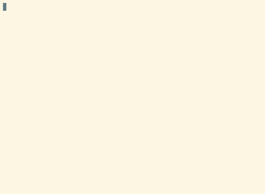

<!-- README.md is generated from README.Rmd. Please edit that file -->

```{r, include = FALSE}
knitr::opts_chunk$set(
  collapse = TRUE,
  comment = "#>",
  fig.path = "man/figures/README-",
  out.width = "100%"
)
```
# fledge

<!-- badges: start -->
[](https://travis-ci.org/krlmlr/fledge)
[](https://ci.appveyor.com/project/krlmlr/fledge)
[](https://www.tidyverse.org/lifecycle/#maturing)
[](https://cran.r-project.org/package=fledge)
<!-- badges: end -->

The goal of *fledge* is to streamline the process of versioning R packages and updating NEWS. Numbers are cheap, why not use them?

## Demo

[](https://asciinema.org/a/173876)

## Workflow for development

The *fledge* package assumes an R package that is version-controlled with Git in a dedicated repository. It will take care of updating `NEWS.md` and `DESCRIPTION` when you want to assign a new version to your package.

1. In commit messages to `master`, mark everything that should go to `NEWS.md` with a bullet point (`-` or `*`). This works for single commits, merge commits, or pull requests.

1. When you want to assign a version number to the current state of your R package, call

    ```r
    fledge::bump_version()
    ```

1. (Optional.) Edit `NEWS.md` as appropriate. When done, call

    ```r
    fledge::finalize_version()
    ```

This has the following effects:

- `NEWS.md` is composed from bits in your most recent commit messages, no need to resolve merge conflicts in `NEWS.md` anymore
- A new version number is assigned automatically (this is modeled after `usethis::use_version()`)
- A tag matching the version number is assigned automatically, with the most recent NEWS included in the tag's message. When you push the tag:
    - contributors `@`-mentioned in the NEWS will be notified
    - links will be added to issues or pull requests referenced from NEWS entries
    - the tag will be listed on GitHub in the "Releases", it's very easy to convert it to a proper release by copying the message that's already part of the tag


## Workflow for releasing to CRAN

1. Call

    ```r
    fledge::bump_version("patch")
    ```
    
    (or `"minor"` or `"major"` as appropriate).

1. Edit `NEWS.md`, convert the changelog to a higher-level description of features and bug fixes.

1. Call

    ```r
    fledge::commit_version()
    ```

1. Make last-minute adjustments before releasing to CRAN.

1. When accepted, call

    ```r
    fledge::tag_version(force = TRUE)
    fledge::bump_version()
    ```
    
    to tag the released version and to switch to a development version immediately.

## First-time users

Setting up *fledge* isn't much different from the regular development workflow:

1. Bump the package version with

    ```r
    fledge::bump_version()
    ```
    
    The `NEWS.md` file may grow large, especially if you haven't used tags in your repository before.

1. Edit `NEWS.md`, call

    ```r
    fledge::finalize_version()
    ```

1. From here on, switch to the [development workflow](#workflow-for-development). Don't forget to use bullet points in your commit or merge messages to indicate NEWS-worthy changes!

## NEWS generation

New entries are added to `NEWS.md` from commit messages to commits in `master`. Only top-level commits are considered (roughly equivalent to `git log --first-parent`.) In those commits, the messages are parsed. Only lines that start with a star `*` or a dash `-` are included, and a line that starts with three dashes makes sure that everything past that line isn't included. Example: The following commit message:

```
Merge f-fancy-feature to master, closes #5678

- Added fancy feature (#5678).

- Fixed bug as a side effect (#9012).

---

The fancy feature consists of the follwing components:

- foo
- bar
- baz
```

will be added as:

```
- Added fancy feature (#5678).
- Fixed bug as a side effect (#9012).
```

to `NEWS.md`.

When retrieving the current NEWS for defining the tag message, the entries between the first two first-level headers (starting with `# `) are returned. You can use second- and third-level headers and add as many empty lines as you want.


## Documentation

The main entry point is `bump_version()`, which does the following:

1. `update_news()`: collects `NEWS` entries from top-level commits
2. `update_version()`: bump version in `DESCRIPTION`, add header to `NEWS.md`
3. Depending on the release type:
    - `"dev"` releases: `finalize_version()`: commit `DESCRIPTION` and `NEWS.md`, create tag with message
    - other releases: `commit_version()`: only commit `DESCRIPTION` and `NEWS.md`

You can always edit `NEWS.md` and call `finalize_version()` again. Both the commit and the tag will be updated.

## Caveats

If you rebase after creating a tag, you need to call `finalize_version()` to make sure the tag is moved to the mainline branch.

If you pushed after calling `finalize_version()` (directly or indirectly), the tag may have been pushed as well.   In this case, invoke `git push origin :vx.y.z.9www` (where `x.y.z.9www` is the new version) to delete the newly created remote tag.  Because of this, only `"dev"` releases are tagged automatically, other releases always must be tagged manually with `tag_version()`.


## Installation

Install from GitHub via

``` r
remotes::install_github("krlmlr/fledge")
```
